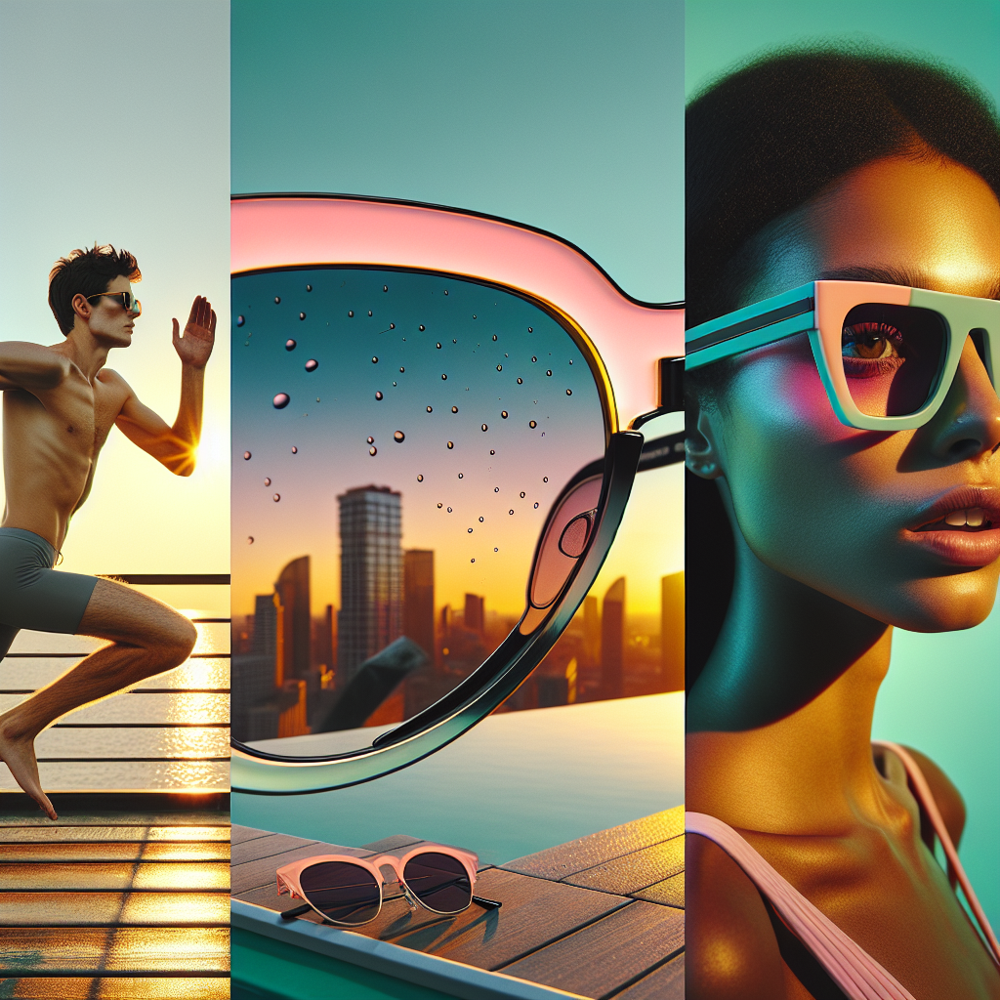

# 🕶️ Summer Sunglasses Campaign – Executive Summary

## 📊 Refined Trend Insights
Summer ’25 Sunglasses Campaign: Executive Summary

Objective  
Align our Summer ’25 offering with the season’s most influential eyewear trends—delivering a concise, high-impact portfolio that resonates with fashion, sport and lifestyle audiences alike.

1. Key Market Trends  
 • Color-Tinted Lenses  
   – Y2K pastels, millennial pink and bold color-block combinations driving social-media engagement  
 • Sport-Inspired Shields & Wraparounds  
   – “Athleisure” momentum fueling demand for single-lens, performance-driven silhouettes  
 • ’90s/Retro Classics  
   – Renewed appetite for metal-frame aviators, chunky acetate wayfarers and cat-eye profiles  

2. Featured Styles & Strategic Fits  
 • SG004 “Sport” Shield  
   – Single-lens wraparound with rubberized temple grips  
   – Captures the peak in outdoor/athleisure spending and influencer endorsement  
 • SG001 “Aviator” Revival  
   – Timeless teardrop frame, customizable with vibrant tinted lenses  
   – Marries heritage appeal with the season’s color-lens craze  
 • SG002 “Wayfarer” Icon  
   – Chunky acetate, angular ’90s silhouette  
   – Versatile canvas for pastel or color-block lenses, driving statement looks  

3. Strategic Rationale  
 • Comprehensive Trend Coverage  
   – From active-lifestyle shield styles to classic aviators and retro fashion frames  
 • Maximum Market Reach  
   – Engages sport-enthusiasts, heritage-style loyalists, and fashion-forward consumers  
 • Strong Seasonal Story  
   – Delivers a cohesive narrative that’s easy to communicate across digital, retail and influencer channels  

By focusing on these three distinct yet complementary styles, we ensure our Summer ’25 campaign is at once streamlined for operational efficiency and powerful in market impact—positioning us squarely at the center of what’s fresh, socially shareable and commercially compelling.

## 🎯 Campaign Visual

    

## ✍️ Campaign Quote
Every Shade of Summer: Sport, Classic, Pastel

## ✅ Why This Works
This phrase captures the sunset-lit collage— from the active wraparound frames to tinted aviators and retro pastels—while nodding to Summer ’25’s key trends in sport shields, timeless classics, and Y2K-inspired hues.

---

*Report generated on 2025-11-29*
